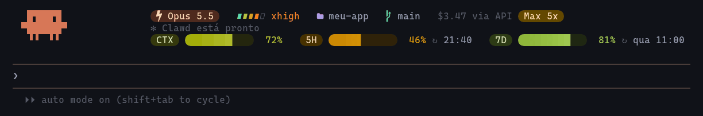
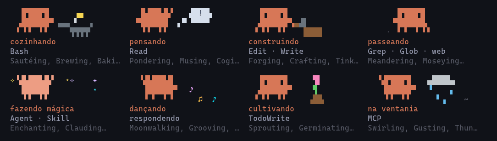
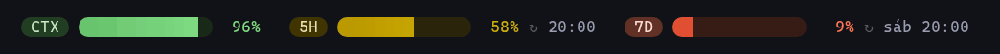
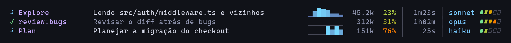

# claude-code-dashboard

Uma faixa viva acima do prompt do Claude Code: um mini Claude que encena o que o Claude está fazendo, quem está trabalhando (modelo, effort, plano) e medidores de contexto e de limite de uso que se atualizam em tempo real.



É um **mod**: um plugin de *function hooks* que roda dentro do Claude Code e desenha na interface a 30 quadros por segundo. Uma statusline comum não chega lá, porque o Claude Code redesenha a `statusLine` no máximo uma vez por segundo, e nenhuma animação fica fluida assim.

## O que tem na faixa

**O mini Claude.** É o bonequinho da tela de boas-vindas, desenhado em pixels de quadrante (2×2 por caractere). A cena muda conforme o que está acontecendo:



| Cena | Quando aparece | Verbos do spinner que caem nela |
|---|---|---|
| cozinhando | `Bash` | Sautéing, Brewing, Baking, Simmering… |
| pensando | `Read` | Pondering, Musing, Cogitating… |
| construindo | `Edit`, `Write` | Forging, Crafting, Tinkering… |
| passeando | `Grep`, `Glob`, busca na web | Meandering, Moseying, Zigzagging… |
| fazendo mágica | `Agent`, `Skill`, workflows | Enchanting, Clauding, Levitating… |
| dançando | escrevendo a resposta | Moonwalking, Grooving, Vibing… |
| cultivando | listas de tarefas | Sprouting, Germinating, Hatching… |
| na ventania | ferramentas de MCP | Swirling, Gusting, Thundering… |

- **Os 189 verbos** que o Claude Code sorteia para o spinner estão distribuídos nessas oito cenas.
- **Durante a ferramenta**, a cena acompanha a ferramenta em uso. Entre uma e outra, volta para a do verbo do turno. Cada cena fica pelo menos 1,5 s na tela para não piscar.
- **Fora de trabalho**, ele pisca quando está à toa, dorme depois de 90 s parado e comemora quando o turno termina.
- **`/nome Kiko`** dá um nome a ele, e a legenda passa a dizer "Kiko está cozinhando".

**Quem está trabalhando.** Modelo, effort (com os mesmos pips coloridos dos medidores), pasta, branch e custo da sessão. Em plano Pro ou Max, o custo aparece como **"via API"** ao lado de um selo do plano: é quanto aquela sessão custaria pagando por token, e não o que você está pagando.

**Os medidores.** Contexto restante, limite de 5 horas e limite semanal, cada um com o horário de reset:



- **Cor:** contínua, do verde (cheio) ao vermelho (vazio), calculada em OKLCH, então não há degraus nem faixas escuras no meio do caminho.
- **Precisão:** as barras preenchem com 1/8 de célula (`▏▎▍▌▋▊▉`).
- **Brilho:** atravessa os três medidores a cada 3 segundos.
- **Alerta:** abaixo de 15%, o medidor pulsa.

**Painel de subagents.** Um script de `subagentStatusLine` deixa as linhas do painel de agentes no mesmo estilo. Cada linha mostra:
- status animado;
- minigráfico de quantos tokens o agente gastou a cada atualização;
- contexto usado;
- tempo rodando;
- modelo e effort.



## Instalação

Você precisa de:
- um Claude Code com suporte a mods (*plugins of function hooks*); testado na **2.1.295**, e a API ainda é de acesso antecipado;
- um terminal com **truecolor** e uma **Nerd Font**, para os ícones e as pontas arredondadas.

### Pelo marketplace

No prompt do Claude Code:

```
/plugin install dashboard --marketplace kyso1/claude-code-dashboard
```

Responda `y` para adicionar o marketplace e escolha o escopo de usuário.

### Pelo clone

```bash
git clone https://github.com/kyso1/claude-code-dashboard ~/.claude/mods/dashboard
```

Em `~/.claude/settings.json`:

```json
{
  "env": { "CLAUDE_CODE_PLUGIN_DIRS": "~/.claude/mods/dashboard" }
}
```

A pasta fica vigiada, então editar um arquivo recarrega o mod na hora.

### Linhas de subagents (opcional)

```json
{
  "subagentStatusLine": { "type": "command", "command": "bash ~/.claude/mods/dashboard/extras/subagent-statusline.sh" }
}
```

Se instalou pelo marketplace, aponte para o `extras/subagent-statusline.sh` dentro da pasta do plugin. Precisa de `jq`. A faixa já mostra o que uma statusline costuma mostrar, então dá para remover a `statusLine` se você usar uma.

## Personalizar

| O quê | Onde |
|---|---|
| Velocidade, largura e pausa do brilho | `SPEED`, `RADIUS`, `PAUSE` em `hooks/gauges.ts` |
| Largura das barras e limite do pulso | `MAX_W`, `MIN_W`, `LOW` em `hooks/gauges.ts` |
| Tempo mínimo de cada cena | `HOLD_MS` em `hooks/clawd.ts` |
| Qual ferramenta vira qual cena | `TOOL_SCENES` em `hooks/clawd.ts` |
| Quadros por segundo | `FPS` em `hooks/register.tsx` |

O mini Claude e o selo do modelo usam a cor `claude` do seu [tema customizado](https://code.claude.com/docs/en/terminal-config#create-a-custom-theme), se ele definir uma. Sem isso, ficam no laranja do Claude.

## Como funciona

```
hooks/
  register.tsx   eventos do Claude Code -> estado -> faixa
  clawd.ts       o mini Claude: sprite, cenas, legenda
  gauges.ts      medidores, rampa de cor e brilho
  identity.ts    modelo, effort, pasta, branch, custo e plano
  paint.ts       cores OKLCH e a grade de células do Raster
extras/
  subagent-statusline.sh
```

| Hook | Para quê |
|---|---|
| `ui.render` em `AbovePrompt` | desenha a faixa como um `Raster` (cada célula com glifo, cor de frente e de fundo) |
| `$.clock.every(33ms)` + `$.ui.blit` | repinta as células 30 vezes por segundo sem refazer a interface |
| `ui.render` em `Spinner` | lê o verbo e o modo do spinner, sem mudar o que ele desenha |
| `tool.call` | qual ferramenta está rodando e com qual argumento |
| `session.start`, `session.measure` | contexto, limites de 5h/7d e custo |
| `classic.Stop`, `classic.PostToolUse` | o effort em uso no turno |
| `prompt.submit`, `turn.complete` | começo e fim do turno |
| `command.run` | o `/nome`, salvo em `$.store` entre sessões |

O plano vem de `~/.claude.json` (`oauthAccount.organizationType`). O mod não lê o arquivo de credenciais.

Três armadilhas que custaram tempo:
- **Sprite fora da grade:** um sprite em pixels de quadrante só pode andar de célula inteira em célula inteira. Um pixel fora da grade e os quadrantes se recombinam numa mancha torta.
- **Verbo do turno:** o verbo do spinner é sorteado uma vez por turno. Por isso a cena segue a ferramenta, senão um turno longo teria uma animação só.
- **Onde passar `$`:** a validação dos mods só aceita passar `$` para funções declaradas no topo do arquivo.

## Desenvolvimento

```bash
claude plugin validate .
claude plugin test .          # 22 testes: cenas, rosto alinhado, rampa de cor, brilho, legenda…
```

As imagens deste README saem do próprio código do mod. `docs/render.mts` desenha as grades de células num canvas e monta os GIFs com ffmpeg:

```bash
PLAYWRIGHT_FROM=/caminho/de/um/projeto/com/playwright/package.json npx -y tsx docs/render.mts docs
```

## Licença

MIT
